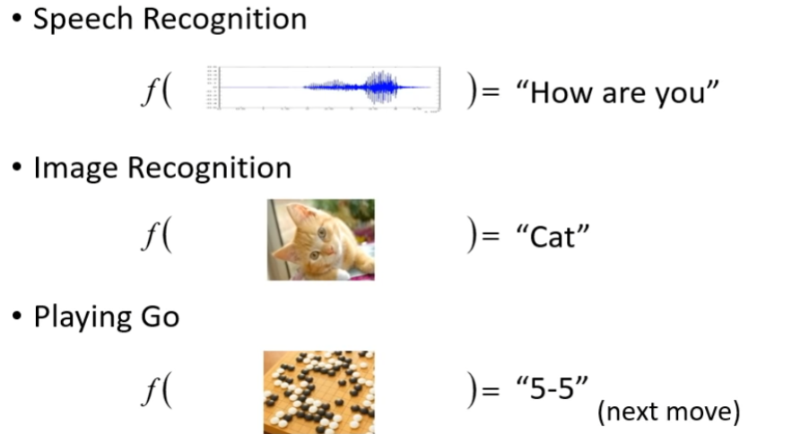
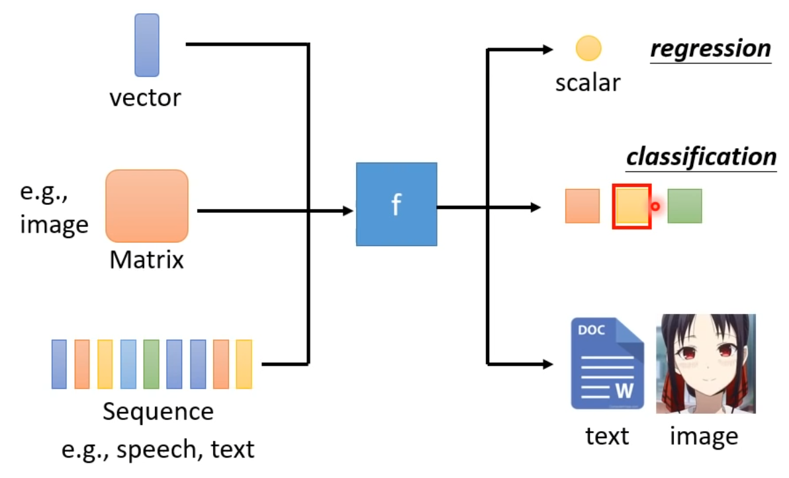
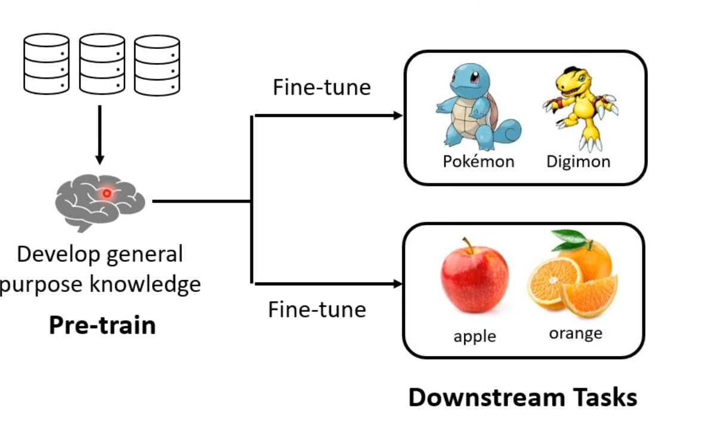
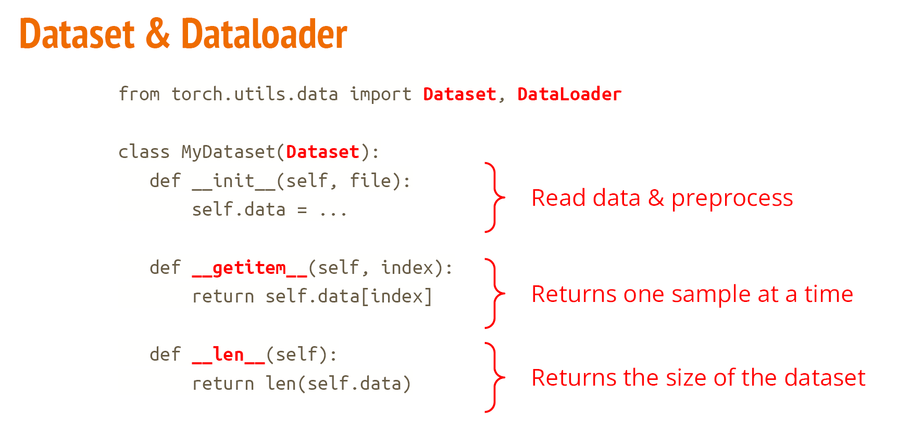
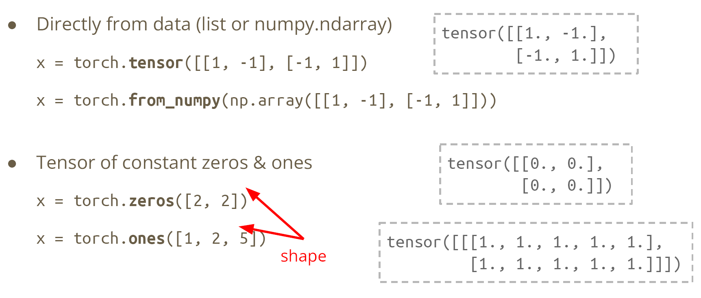

# L1: Introduction

## What is ML

"ask machine to help us to find a *function*"



DL: use neural network to find *the function*



Output: regression, classification, rich content

## How to "teach" machine

- Supervised Learning 监督学习

​	Collect data -> Tag data(labeles) -> Train

- Self-supervised Learning 无监督学习

  Why? Collect data is not efficient for every work.

  

  Pre-Train("learn basic skill") -> Downstream Tasks

## PyTorch

Training - Validation - Testing

### Dataset and Dataloader

```python
DataLoader(dataset, batch_size, _shuffle_)
```

Training: shuffle=True
Testing: shuffle=False



### Tensor

high-dimensional matrices



```x.transpose(0, 1)``` exchange the dim

```x.squeeze(0)```  remove a dim

```x.unsqueeze(1)``` expand a dim

```torch.cat([x,y,z], dim=1)``` concatenate tensors with specific dim

